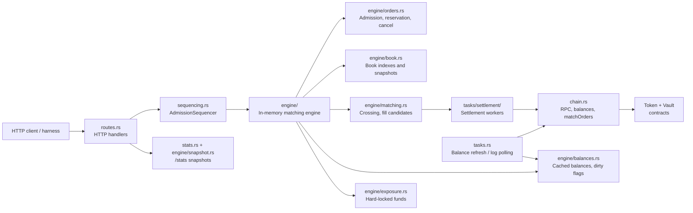
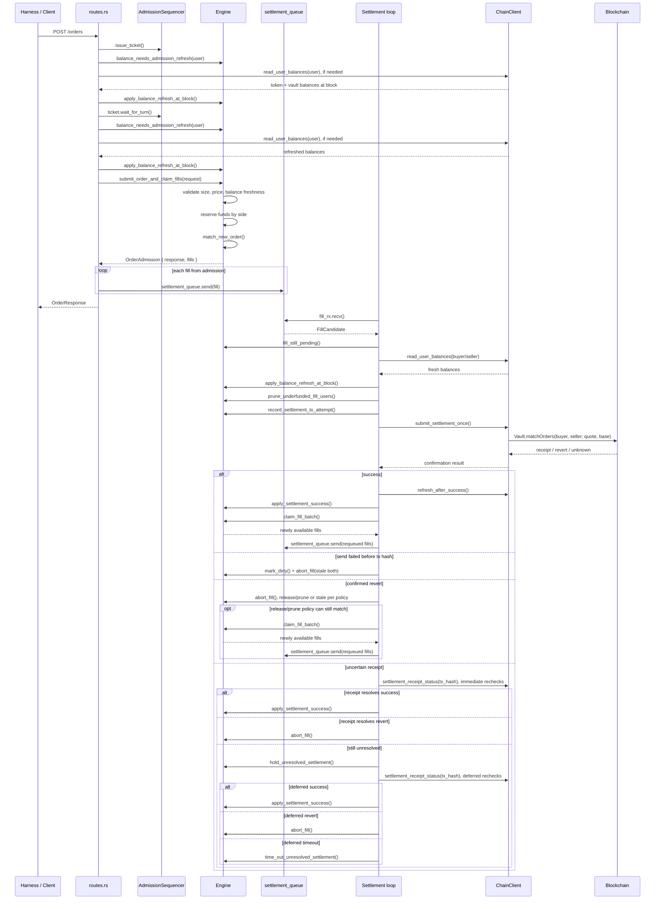

# AJ - Vault Exercise submission

# 1. Overview
I used codex for formatting // spell check for this writeup but all initial versions of this were written by me before being cleaned up.

Small note as I am not very familiar with Rust: I made a point to keep non-test files under `service/src` below 500 lines. This added some complexity in a few places where I think longer files (Particularly in the engine part) would have been easier, if I had to do it over I would take this into consideration and be a little more lenient with the file size.

Also, my eyesight is lowkey dying, so I tend to log some things with color and formatting because it makes runtime output easier for me to scan.
# 2. Repo Run Stats Comparison (50k order run)

| Metric | First run | Last run |
|---|---:|---:|
| Orders received | 844 | 50,556 |
| Orders accepted | 659 / 844 (78.1%) | 38,372 / 50,556 (75.9%) |
| Orders rejected | 185 / 844 (21.9%) | 12,184 / 50,556 (24.1%) |
| Admission failures | 185 | 12,184 |
| Insufficient balance rejects | 185 | 12,181 |
| Stale cache rejects | 0 | 3 |
| Orders matched | 336 / 659 (51.0%) | 18,150 / 38,372 (47.3%) |
| Fill side events | 590 | 35,142 |
| Settlements attempted | 303 / 303 (100.0%) | 17,674 / 17,681 (100.0%) |
| Precheck passed | 303 / 303 (100.0%) | 17,674 / 17,674 (100.0%) |
| Settlements reverted | 0 (0.0%) | 18 (0.1%) |
| Settlement success | 295 | 17,571 |
| Settlement pending | 8 | 85 |
| Settlement unattempted | 0 | 7 |
| Currently open orders | 306 | 10,492 |
| Open status | 281 | 10,212 |
| Partial status | 25 | 280 |
| Lifetime accepted pct open | 46.4% | 27.3% |
| Stored orders | 659 | 38,372 |
| Indexed book IDs | 325 | 10,945 |
| Pending engine fills | 0 | 0 |


## Notes about the adversarial harness
When placing orders, the harness builds a normal order payload by reading the user’s EOA balance, converting it into whole tokens, randomly choosing side/type/price, and then choosing a size.

In 25% of cases, it sets the raw size to 1.5x-3x the user’s token balance. But it does not mark that order as special or “oversized”; it just submits the normal payload with side, order_type, price, and WAD size.

The important mismatch is that buy admission does not check balance >= raw size. It checks:

required_balance = ceil(price * size / WAD)
So a buy with 1.5x raw size can still pass if the price is low enough. For example, 1.5x size at 0.40 price only requires 0.60x balance.

Meaning we should not expect exactly 25% of all orders to reject. Some of the 25% “oversized” bucket can still be accepted, especially buys at lower prices.


# 3. Architecture

This summarizes the visible Rust service structure under `service/src`.

## Top-Level Entries

| Path | Summary |
| --- | --- |
| `engine/` | Core in-memory matching engine. It owns orders, book indexes, balance reservations, fill candidates, matching rules, and settlement state application. |
| `tasks/` | Submodules for background task implementations. Currently this holds the settlement worker logic used by `tasks.rs`. |
| `chain.rs` | Blockchain/RPC adapter. It reads token and vault balances, submits `matchOrders` transactions, confirms receipts, checks receipt status, and scans logs for users whose balances need refresh. |
| `chain_tests.rs` | Dedicated tests for chain log parsing, including indexed address topic decoding and dirty-user event aggregation. |
| `engine_tests.rs` | Dedicated tests for engine behavior, including matching priority, balance reservation, stale order pruning, market order behavior, fill claiming, and stats accounting. |
| `main.rs` | Application entrypoint. It loads config, builds `ChainClient`, initializes shared `AppState`, starts background loops, and wires the Axum HTTP routes. |
| `routes.rs` | HTTP route handlers for order submission, cancellation, order listing, balance views, book snapshots, and stats snapshots. |
| `runtime.rs` | Runtime tuning helpers. It reads environment variables for balance cache ages, background loop intervals, RPC timeouts, receipt retries, and receipt reconciliation windows. |
| `sequencing_tests.rs` | Dedicated async tests for ordered gates and admission sequencing, including gap handling, idempotent completion, receipt apply ordering, and ticket-ordered order admission. |
| `sequencing.rs` | Ordering utilities. It provides `OrderedGate` and `AdmissionSequencer` so concurrent work can be admitted or applied in deterministic sequence order. |
| `stats.rs` | Counter and snapshot definitions for service metrics, plus percentage and ratio helpers used by the engine and `/stats` endpoint. |
| `tasks.rs` | Background task entrypoints. It runs active balance refresh, chain log polling, periodic stats logging, and re-exports the settlement loop. |
| `types.rs` | Shared API and domain types, including order side/type/status, request and response DTOs, book snapshots, balance views, and API error responses. |

## `engine/` Submodules

| Path | Summary |
| --- | --- |
| `engine/mod.rs` | Defines the main `Engine`, internal `Order` and `BalanceState` models, fill candidates, and module layout. |
| `engine/orders.rs` | Handles order admission, validation, reservation, cancellation, visible open order listing, and terminal order state transitions. |
| `engine/matching.rs` | Finds crossing orders, prepares fill candidates, manages in-flight fill state, applies successful settlements, and aborts failed fills. |
| `engine/book.rs` | Maintains limit-order price indexes and builds public book snapshots with bids, asks, spread, and midpoint. |
| `engine/balances.rs` | Manages cached balances, dirty markers, refresh freshness, user balance views, and pruning when cached balances no longer support reservations. |
| `engine/exposure.rs` | Computes hard-locked funds and checks whether users can safely keep live or in-flight orders after fills. |
| `engine/snapshot.rs` | Builds `StatsSnapshot` values and records settlement/order metric counters. |
| `engine/math.rs` | Small numeric helpers for U256 math, WAD formatting, and reservation calculations. |

## `tasks/` Submodules

| Path | Summary |
| --- | --- |
| `tasks/settlement/mod.rs` | Settlement loop coordinator. It selects sequential, receipt-concurrent, or fully concurrent settlement modes from environment config. |
| `tasks/settlement/outcome.rs` | Settlement lifecycle handling. It prechecks fills, submits transactions, confirms receipts, applies success, and reconciles uncertain outcomes. |
| `tasks/settlement/concurrency.rs` | Concurrency support for settlement workers, including user lock striping and reorder invalidation tracking. |
| `tasks/settlement/requeue.rs` | Helper for claiming and enqueueing newly available fills after settlement outcomes release more matchable orders. |
| `tasks/settlement/settlement_tests.rs` | Dedicated tests for settlement confirmation outcomes, uncertain receipts, unresolved fills, reverts, and send failures. |

### Service Architecture


### Order Admission and Settlement Lifecycle

# 4. Design choices 


## Harness edits

The harness changes are limited to connection pooling and runtime control; they do not change the service HTTP API. The upstream harness created HTTP and RPC connections too aggressively under concurrency, which could cause runner crashes or timeouts from too many individual connections. To fix that, the harness now uses a shared `HarnessClients` struct with reusable `service: reqwest::Client` and `rpc: alloy::transports::http::reqwest::Client` clients, both configured with a 5 second timeout and a larger idle connection pool so setup, provider/reader creation, order loops, and chain loops can run higher concurrency more reliably.


## General concurrency things
The main concurrency change is that slow blockchain settlement work was moved out of the POST /orders path. The harness now reuses pooled HTTP/RPC clients, so it can generate high-concurrency load without wasting time on connection setup. On the service side, order admission and matching are still sequenced through admission tickets (Admission tickets are just a FIFO gate for POST /orders) and the engine mutex, which keeps order IDs, fill IDs, book mutation, and price-time priority deterministic even when requests arrive concurrently.

Market orders now cross immediately and cancel any leftover size, while limit orders also match immediately. The HTTP path creates fill candidates and pushes them to async settlement workers. Those workers handle balance refreshes, Vault.matchOrders(...), and receipts in the background, using bounds like semaphores, per-user locks, and apply gates so settlement can run concurrently without corrupting the book state chosen by the matching engine.


## Balance Accounting at Order Admission

This section describes how the engine decides whether a new order can enter the book. It is separate from settlement durability: these checks protect the live in-memory engine while the process is running.

For every order, the service uses a fresh-enough on-chain token balance, then checks the new order against the user's hard-available balance. Buy orders reserve `ceil(price * size / WAD)`, while sell orders reserve `size`. There is no separate close-position exception in the engine.

Hard locks are intentionally narrower than total reservations. Market orders and in-flight fills count as hard locks. Resting limit orders increase `reserved`, but they are not fully hard-locked against future limit-order admission.

### Market Orders

Market orders are admitted only if the full requested market-order reservation fits against current real balance minus hard locks. Once accepted, they cross immediately against available older resting limits. Any unmatched remainder is cancelled, while any matched in-flight amount stays hard-locked until settlement succeeds, fails, or is released.

Because market orders create immediate settlement risk, accepting one can make older resting limit orders no longer fit the user's real balance. When that happens, the engine prunes eligible over-reserved sibling orders by marking them stale.

### Limit Orders

Limit orders add their full notional or base requirement to `reserved` at placement, but resting limits are not hard-locked for later admission. This means a user with `$100` can place multiple individually affordable limits, such as ten `$90` orders, and become over-reserved.

That overbooking is deliberate because it lets users express multiple resting intents with the same balance, supports laddered quotes across price levels, and makes the book deeper for matching and price discovery. The tradeoff is that not every visible resting order is guaranteed to remain fundable after other fills or balance changes. The service handles this by treating market orders and in-flight fills as hard locks, then pruning or staling live orders after balance refreshes, settlement success, and failed settlement paths when refreshed `reserved > real`.

### Cache

I used a hybrid caching strategy because the service needs two things that pull in opposite directions: fresh enough balances to reject bad orders, and low enough RPC load to survive high-concurrency order flow. Reading the chain for every user on every loop would be too slow and expensive, but trusting a plain time-based cache would admit too many orders against stale balances.

The cache therefore combines three signals:

- **Time-based freshness:** cached balances expire after a short admission window.
- **Dirty marking:** token/vault logs mark known users dirty when transfers, matches, or withdrawals may have changed their balances.
- **Targeted active refresh:** the background loop only refreshes users with reserved balances, prioritizing dirty users first and then the oldest cache entries.

Admission uses the cache only when it exists, is not dirty, and is recent enough. Settlement is stricter: before submitting `Vault.matchOrders(...)`, the worker refreshes both sides again and checks that the fill is still fundable. This keeps the fast path cheap while still forcing fresh reads at the points where stale data would be most dangerous.


# 5. Ghost Orders and Limitations

A ghost order is an order that matches off-chain but cannot settle on-chain. In this service, that risk exists because matching is based on cached on-chain balances, while the actual settlement happens later through `Vault.matchOrders(...)`. A user may have enough token balance when an order is admitted or prechecked, then move funds or change allowance before the settlement transaction executes.

The service reduces this risk by refreshing stale balances before admission, sequencing admission through tickets, refreshing users with reserved balances in the background, marking users dirty from chain logs, and refreshing both buyer and seller again immediately before settlement. If the fill is already underfunded at that point, the service skips transaction submission. If settlement reverts or sending fails, it refreshes/marks dirty and either releases, prunes, or stales affected orders. If a transaction hash exists but the receipt is uncertain, the fill stays locked while the service rechecks; after a bounded timeout, both orders are staled and reservations are released.

### Remaining gap
Pre-settlement refresh is still separate from transaction execution. More frequent cache refreshes reduce stale admission and stale book liquidity, but they do not fully remove the final race between the last balance read and `Vault.matchOrders(...)` landing on-chain. Stronger production guarantees would likely require escrow, on-chain reservation, or another atomic commitment mechanism before matching.


### Order Design

Resting limit orders intentionally allow overbooking: each new limit only needs to be individually affordable against current real balance minus hard locks. This lets users place multiple resting intents or ladder quotes with the same balance, improving book depth and matching. The tradeoff is that some visible liquidity can become stale after fills or balance changes, so the service prunes or stales live orders after refreshes, successful fills, and failed settlement paths.

Another gap is durability. Orders, reservations, fill candidates, in-flight settlements, tx hashes, receipt outcomes, balance-read blocks, and dirty-user blocks are all in memory, so restart recovery is unsafe. In production, I would persist those records and resume settlement only from durable state.

A further improvement would be a final `eth_call` simulation of the exact `Vault.matchOrders(...)` call against pending state before broadcast. That would catch many last-moment balance or allowance failures and turn doomed transactions into precheck failures instead of settlement reverts.


# 6. Admission


The service validates each new order against a fresh-enough on-chain token balance. The admission path is:

`POST /orders` -> issue admission ticket -> refresh balance if missing, dirty, or too old -> wait for turn -> refresh/check again -> validate and reserve.

Admission rejects zero size/price, reservation overflow, stale balance after attempted refresh, or insufficient hard-available balance. In the current service/contract model there are no maker or taker fees, so reservation math is:

- Buy reserve: `ceil(price * size / WAD)`
- Sell reserve: `size`

Hard-available balance means real on-chain token balance minus hard locks. Market orders and in-flight fills count as hard locks; resting limit orders increase `reserved` but are not fully hard-locked for future limit-order admission. Section 4 covers the accounting tradeoff for that choice, and Section 7 covers how marketable orders cross the book.

If fees were added later, they would need to be included in the reservation formula. For example, a buyer-side fee would make buy reserve roughly:

`ceil(price * size / WAD) + fee`

and a seller-side fee would require either reserving extra token balance or settling fees from proceeds, depending on the fee model.


# 7. Order Book + Matching


Most of this logic lives in `service/src/engine`, especially `orders.rs`, `matching.rs`, and `book.rs`.

The engine stores full order state in `orders: HashMap<String, Order>`. The public book is maintained through limit-order indexes keyed by price:

- `bids: BTreeMap<U256, VecDeque<String>>`
- `asks: BTreeMap<U256, VecDeque<String>>`

`BTreeMap` keeps prices sorted, so bids can be walked from highest to lowest and asks from lowest to highest. Each price level stores order ids in a `VecDeque`, which preserves FIFO ordering within the same price level. Matching and snapshots lazily clean stale index entries, so the indexes may temporarily contain filled, cancelled, stale, or in-flight order ids, but only live and available limit orders are used.

The current flow is: match synchronously, settle asynchronously. `POST /orders` refreshes admission balance if needed, waits for the admission ticket, submits the order through `submit_order_and_claim_fills(...)`, and immediately sends any generated `FillCandidate`s to the settlement queue. Settlement workers later refresh balances again, submit `Vault.matchOrders(...)`, confirm receipts, and apply success or abort/revert handling.

For market orders, `POST /orders` immediately walks the opposite book best-price-first and creates fill candidates against available older resting limits. Any unmatched remainder is cancelled before the response returns. Market orders never rest in the book and are hidden from `GET /orders` while their matched amount is waiting for settlement. If a market order matched, the engine keeps internal in-flight state so settlement success, revert, or abort can update reservations and fill state safely.

For limit orders, `POST /orders` immediately crosses any marketable quantity against the opposite book before indexing the new order. After that, the order is inserted into the limit-order index. Public book depth only counts live, available limit liquidity from users without an in-flight order, so in-flight matched quantity is not exposed as resting depth.

The tradeoff is that settlement can still fail after off-chain matching because balances or allowances can change before `Vault.matchOrders(...)` executes, or because transaction send, receipt, revert, or unknown-outcome handling fails. That is why the service still needs pre-settlement refresh, dirty marking, stale orders, requeue handling, and revert/abort paths. Market-order behavior is still clean from the client perspective: matching and remainder cancellation happen immediately, while chain settlement remains asynchronous.


# 8. Settlement

Settlement is where an off-chain fill becomes an on-chain `Vault.matchOrders(...)` call.

After the engine creates a `FillCandidate`, a settlement worker submits it with the operator key from config:

```rust
vault.matchOrders(buyer, seller, quote, base).send().await
```

Before sending, the worker refreshes both users' on-chain balances and checks whether the fill is still fundable. If either side is underfunded after refresh and pruning, the service records a precheck failure, aborts the fill, and skips the transaction. If both sides are still funded, it records a transaction attempt and broadcasts `matchOrders`.

After broadcast, settlement has three main outcomes:

1. **Success:** the service applies the fill, updates order state and reservations, refreshes balances, and requeues any newly available matches.
2. **Known failure:** if sending fails before a transaction hash exists, or if the receipt confirms a revert, the service marks affected users dirty and aborts, releases, prunes, or stales orders according to the active settlement policy.
3. **Uncertain receipt:** if a transaction hash exists but the service cannot prove success or revert, the fill remains pending and reservations stay locked while the service rechecks the receipt.

The uncertain path is intentionally conservative. If later receipt checks prove success, the service applies the fill. If they prove revert, it handles the fill as a known failure. If the receipt remains unresolved after the deferred timeout, the service records an unknown outcome, marks both users dirty, stales both orders, aborts the fill, and releases reservations.

The reason for holding locks during uncertainty is accounting safety. Once a transaction hash exists, the service cannot assume failure just because receipt lookup is temporarily unavailable. Releasing funds too early could let another fill reuse the same balance while the original transaction later succeeds on-chain.


# 9. Balance Reconciliation

On-chain balances can change underneath the service, so the goal is to keep cached balances fresh enough for admission and settlement without polling every user continuously.

A cached balance is trusted for admission only if it:

- Exists.
- Is not marked dirty.
- Was refreshed within the admission freshness window.

On `POST /orders`, the route checks the user's cache before and after waiting for the admission ticket. If the cache is missing, dirty, or too old, the service reads the user's ERC20 balance and Vault balance from chain, records the block number, and updates the cache before relying on it.

The service keeps balances fresh through three paths:

- **Admission refresh:** refreshes the submitting user before order admission when their cache is stale, dirty, or missing.
- **Active refresh loop:** only considers users with reserved balances, prioritizing dirty entries first and then the oldest stale entries. After refresh, it prunes orders if the refreshed balance no longer supports the user's reservations.
- **Log-based dirty marking:** polls token and vault logs. Transfers and matches mark both indexed users dirty; withdrawals mark the withdrawing user dirty.

Dirty marking is block-aware. A refresh only clears dirty state if it was read at or after the dirty event's block, which avoids trusting an older balance read after a newer chain event.

Dirty does not mean every user is refreshed immediately. It means the cached balance is no longer trusted for admission or settlement. The next admission path, pre-settlement path, or active refresh pass will refresh it before relying on it. The balance-view endpoint is separate: it reads fresh chain values for the response, but does not mutate or clear the cached balance entry.

Before settlement submission, the worker refreshes both the buyer and seller again and checks that the fill is still fundable. In concurrent settlement mode, this happens as part of the pre-submit check before the ordered transaction-submit gate, so it is a safety check before broadcast rather than always the literal final instruction before `Vault.matchOrders(...)`.

This reduces stale-cache failures, but it does not eliminate the final race before the transaction lands on-chain, so settlement still needs revert and uncertain-receipt handling.
